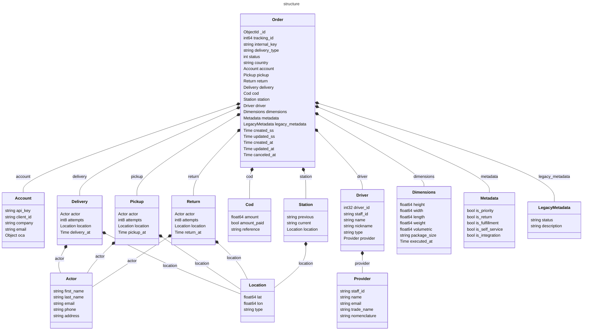

```mermaid
---
title: structure
---
classDiagram
    class Order {
        ObjectId _id
        int64 tracking_id
        string internal_key
        string delivery_type
        int status
        string country
        Account account
        Pickup pickup
        Return return
        Delivery delivery
        Cod cod
        Station station
        Driver driver
        Dimensions dimensions
        Metadata metadata
        LegacyMetadata legacy_metadata
        Time created_ss
        Time updated_ss
        Time created_at
        Time updated_at
        Time canceled_at
    }
    class Account {
        string api_key
        string client_id
        string company
        string email
        Object oca
    }
    class Pickup {
        Actor actor
        int8 attempts
        Location location
        Time pickup_at
    }
    class Delivery {
        Actor actor
        int8 attempts
        Location location
        Time delivery_at
    }
    class Return {
        Actor actor
        int8 attempts
        Location location
        Time return_at
    }
    class Cod {
        float64 amount
        bool    amount_paid
        string  reference
    }
    class Station {
        string    previous
        string    current
        Location  location
    }
    class Driver {
        int32     driver_id
        string    staff_id
        string    name
        string    nickname
        string    type
        Provider  provider
    }
    class Provider {
        string staff_id
        string name
        string email
        string trade_name
        string nomenclature
    }
    class Dimensions {
        float64 height
        float64 width
        float64 length
        float64 weight
        float64 volumetric
        string  package_size
        Time    executed_at
    }
    class Metadata {
        bool is_priority
        bool is_return
        bool is_fulfillment
        bool is_self_service
        bool is_integration
    }
    class Actor {
        string first_name
        string last_name
        string email
        string phone
        string address
    }
    class Location {
        float64 lat
        float64 lon
        string  type
    }
    class LegacyMetadata {
        string status
        string description
    }
    
    
    Order *-- Account : account
    Order *-- Pickup : pickup
    Order *-- Delivery : delivery
    Order *-- Return : return
    Order *-- Station : station
    Order *-- Cod : cod
    Order *-- Driver : driver
    Order *-- Dimensions : dimensions
    Order *-- Metadata : metadata
    Order *-- LegacyMetadata : legacy_metadata
    
    Delivery *--  Actor : actor
    Delivery *--  Location : location
    
    Pickup *--  Actor : actor
    Pickup *--  Location : location
    
    Return *--  Actor : actor
    Return *--  Location : location
    
    Station *--  Location : location
    
    Driver *--  Provider : provider 
    
```