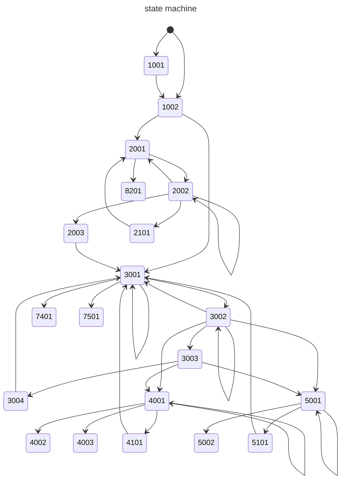

```mermaid
---
title: state machine
---
stateDiagram-v2
    [*]  --> 1001 %% NEW_DRAFT
    [*]  --> 1002 %% NEW_ORDER_CONFIRMED
    1001 --> 1002 %% DRAFT_CONFIRMED
    1002 --> 2001 %% TO_PICKUP
    1002 --> 3001 %% DIRECT_TO_STORE
    
    2001 --> 2002 %% DRIVER_ASSIGNED_TO_PICKUP
    2002 --> 2001 %% DRIVER_CANCELLATION
    2002 --> 2002 %% DRIVER_REASSIGNED_TO_PICKUP
    2002 --> 2003 %% PICKUP_CONFIRMED
    2002 --> 2101 %% PICKUP_FAILED
    2101 --> 2001 %% NEW_PICKUP_ATTEMPT
    2001 --> 8201 %% MAX_ATTEMPTS_EXCEDED
    2003 --> 3001 %% TO_STORE
    
    3001 --> 3002 %% CONTAINER_ASSIGNED
    3002 --> 3002 %% CONTAINER_REASSIGNED
    3002 --> 3001 %% CONTAINER_CANCELLED
    3002 --> 3003 %% VEHICLE_ASSIGNED
    3003 --> 3004 %% TRANSFER_REQUESTED
    3004 --> 3001 %% NEW_STORAGE_POINT
    3001 --> 7401 %% MAX_ATTEMPTS_EXCEDED_DELIVERY    
    3001 --> 7501 %% MAX_ATTEMPTS_EXCEDED_RETURN
    3002 --> 4001 %% CONTAINER_ASSIGNED_TO_DELIVERY
    3002 --> 5001 %% CONTAINER_ASSIGNED_TO_RETURN
    3003 --> 4001 %% DRIVER_ASSIGNED_TO_DELIVERY
    3003 --> 5001 %% DRIVER_ASSIGNED_TO_RETURN
    3001 --> 3001 %% SWITCH_IN_STORE
    
    4001 --> 4001 %% DRIVER_REASSIGNED_TO_DELIVERY
    4001 --> 4002 %% DELIVERY_CONFIRMED
    4001 --> 4003 %% 
    4001 --> 4101 %% DELIVERY_FAILED
    4101 --> 3001 %% NEW_DELIVERY_ATTEMPT
    
    5001 --> 5001 %% DRIVER_REASSIGNED_TO_RETURN
    5001 --> 5002 %% RETURN_CONFIRMED
    5001 --> 5101 %% RETURN_FAILED
    5101 --> 3001 %% NEW_RETURN_ATTEMPT
    

```